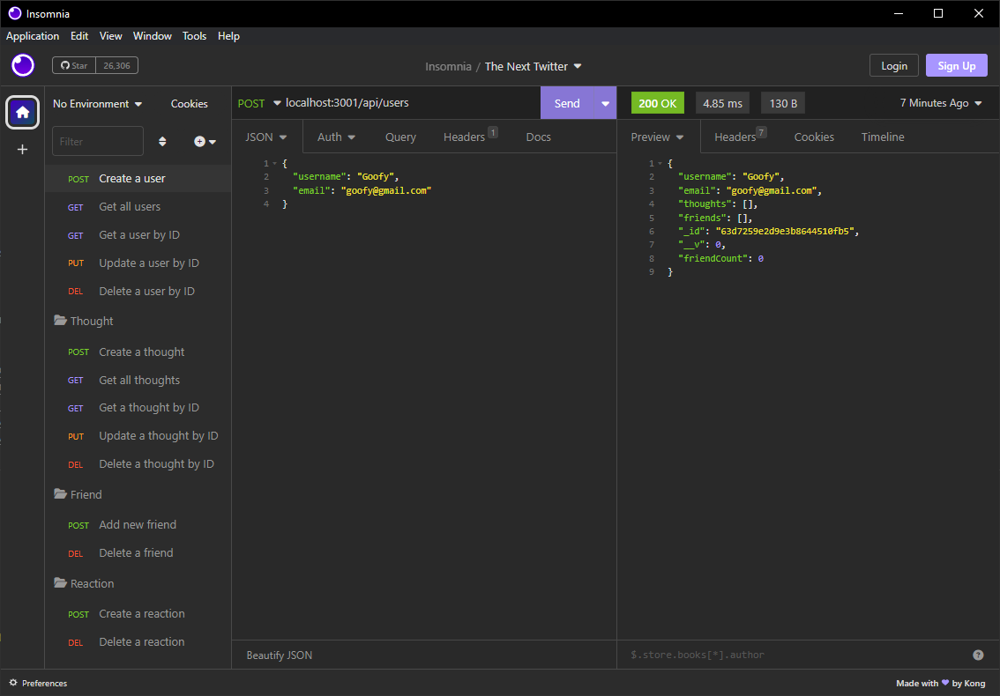
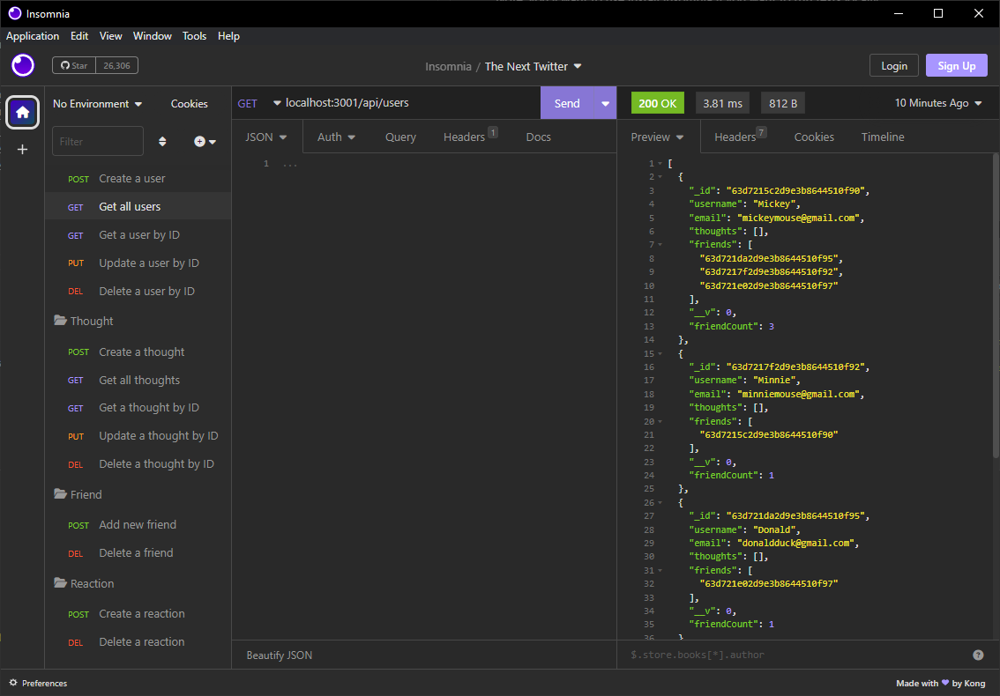
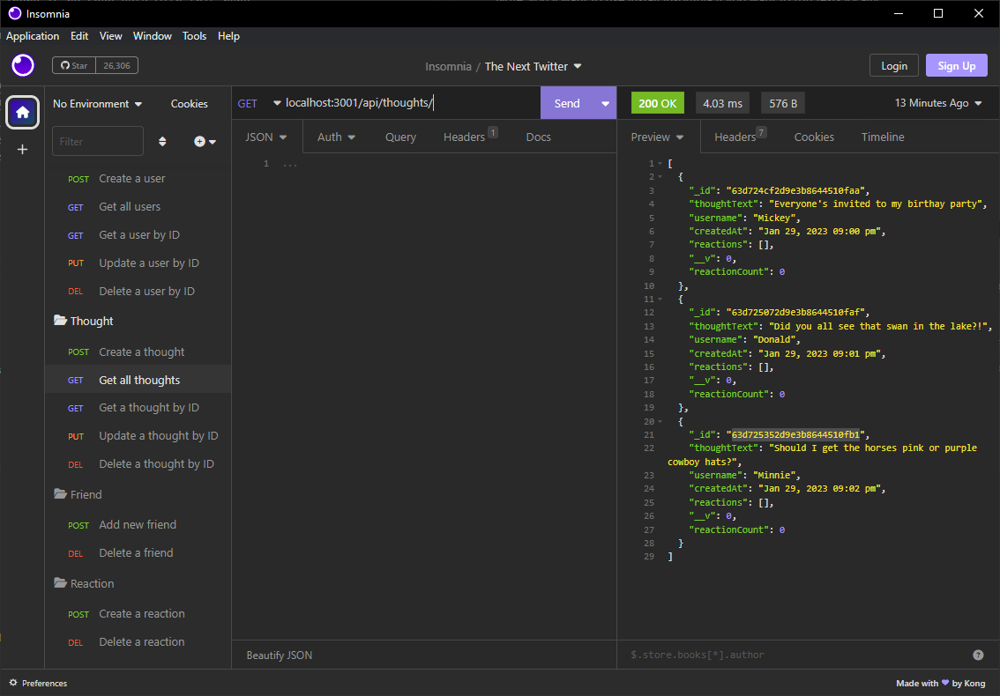
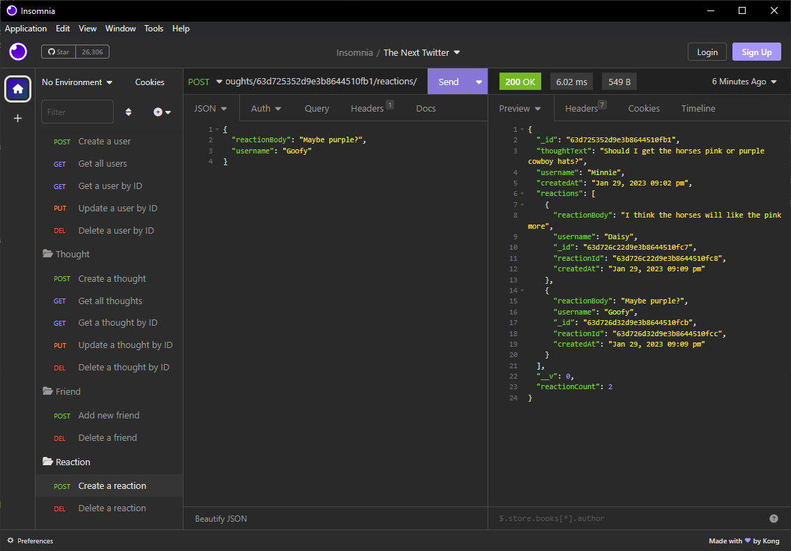

# The Next Twitter 🪁

## Description
An API for a social networking web app. Perhaps it will be the next Twitter! Users can post their thoughts, add new friends, and react to their friends' thoughts. 

The backbone is made up of Express.js, MongoDB for the database, and Mongoose for the ODM (object data modeling). Testing is done using Insomnia.

## Table of Contents

- [Installation](#installation)
- [Tech Used](#tech-used)
- [Preview](#preview)
- [Licensing](#licensing)
- [Contact Info](#contact-info)

## Installation
Clone the GitHub repo. Once repo is downloaded, to install the npm dependencies, type `npm i`.

Start the server with `npm start`. There is no seed data with this repo.

Note: you'll want to use install Insomnia if you want to run tests locally.

## Tech Used
* [Express.js](https://www.npmjs.com/package/express)
* [MongoDB](https://www.mongodb.com/)
* [Mongoose ODM](https://www.npmjs.com/package/mongoose)
* [Insomnia](https://insomnia.rest/)
* [Moment.js](https://momentjs.com/)

## Preview
To see the API in action, here's a [Google Drive Link]().

## Licensing
[MIT License](LICENSE)

## Contact Info
For questions about the repo, contact Susan.